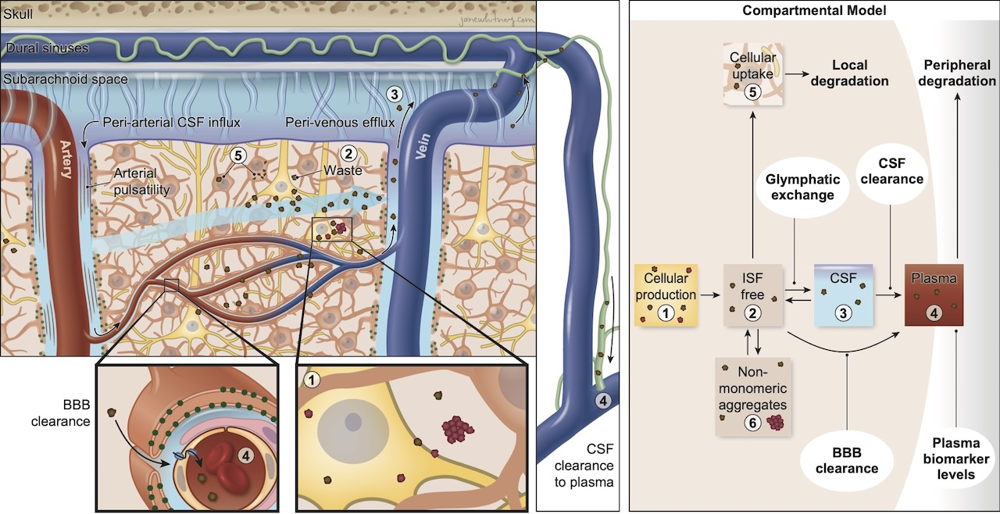

# Introduction

This repository contains the [mrgSolve](https://mrgsolve.org/) simulation script used for the MedRxiv manuscript ["The
glymphatic system clears amyloid beta and tau from brain to plasma in humans"](https://doi.org/10.1101/2024.07.30.24311248).

This simulation is based on the following four-compartment model of brain to plasma fluid exchange:

# System Requirements

This script was tested on a MacOS v14 system using:

- [RStudio](https://posit.co/download/rstudio-desktop/): Version 2025.09.1+401 (2025.09.1+401)
- [R](https://cran.r-project.org/): 4.5.1 (2025-06-13)
- [mrgSolve](https://mrgsolve.org/): 1.6.1

We recommend opening the script in RStudio and install mrgSolve from the UI.

# How to use

Source the script in RStudio and wait a few seconds to finish execution.
The output of the simulation is saved in the `output` folder and consists in the following files:

* `model/biomarker_comp_model.cpp`: The mrgSolve model parameters.
* Plots `INCREASE_Ab40.pdf/tiff` and `DECREASE_Ab40.pdf/tiff`: depict the modelled effects of increasing and decreasing
  the Ab40 concentration.
* `df_compart_BIO_P2_SIMULATION.csv`: Shows all the simulation steps
* `df_compart_BIO_P2_SIMULATION_RATIOS.csv`: Shows all the simulation ratios

Copyright 2025 [Applied Cognition Inc](https://appliedcognition.com/).